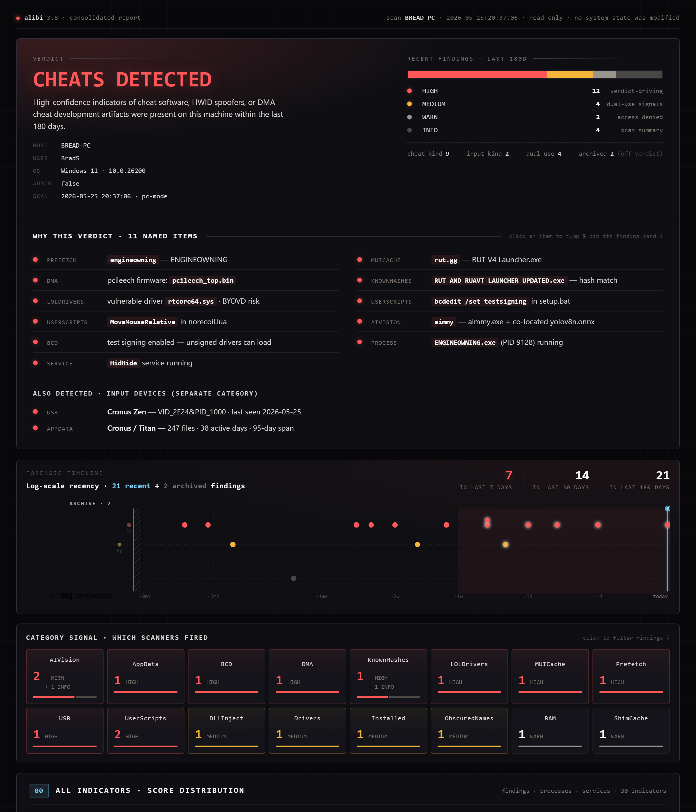
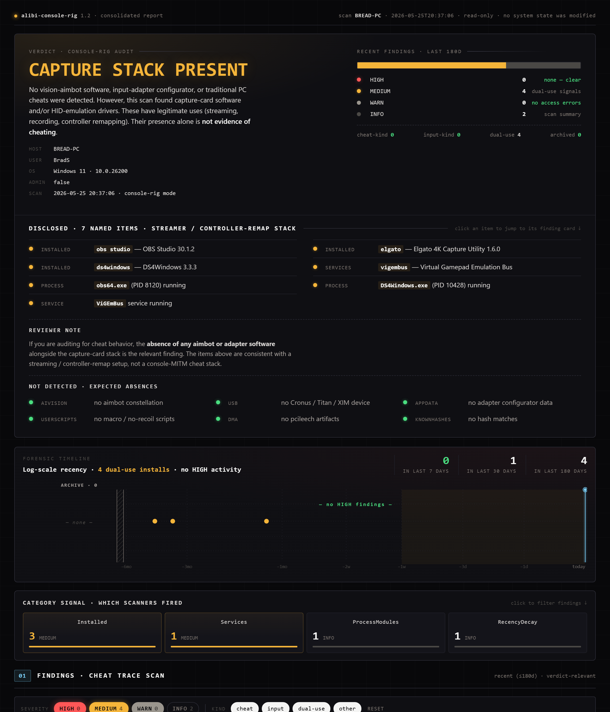
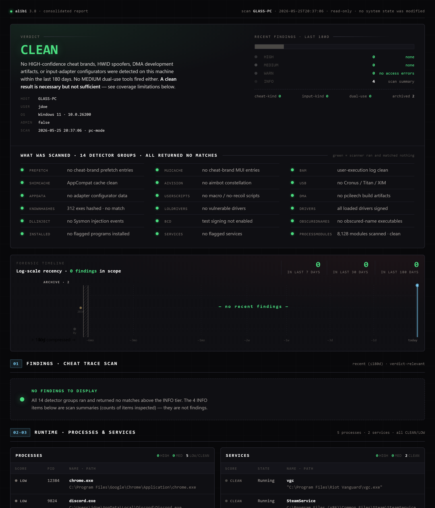

# Alibi

**A read-only forensic kit for Windows that lets a gamer prove their machine isn't running cheats.**

You run one scan. Four files land on your Desktop — two plain-text reports and two matching HTML visuals. You send them to whoever asked. **No system changes, no installed software, no telemetry.** Exactly one outbound network call (the opt-in LOLDrivers BYOVD cross-reference) is prompted before it runs and disclosed in every report.

Primarily built for **Call of Duty**, but the same engine covers CS2, Apex, Tarkov, Rust, R6, and Marvel Rivals.

Author: **Bread** — Activision ID `Bread#3266221`, GitHub [@Sutaigne](https://github.com/Sutaigne). Contributor: **Drownmw**.

---

## Quick start

1. Get the kit: download [`dist/alibi.zip`](dist/alibi.zip) and unzip it.
2. Right-click **`Run scan.bat`** → **Run as administrator**.
3. Click **YES** on the UAC prompt and wait ~2–3 minutes.
4. Collect the four output files from your Desktop and send the ones with findings.

New here? Read [**`START HERE.txt`**](START%20HERE.txt) first.

## Why two scans?

| Mode | Looks at your PC as… | Detects |
|---|---|---|
| **PC** | a PC gamer's machine | PC cheats, DMA artifacts, HWID spoofers |
| **Console-rig** | a PC wired into a console rig | capture-card software, vision aimbots, XIM/Cronus/ReaSnow adapters |

Running both covers every scenario this PC could be involved in. If you only play one way, the other report will be `CLEAN` — that's expected. The relevant report is the one with findings.

## Verdict tiers

| Mode | Verdicts |
|---|---|
| PC | `CHEATS DETECTED` / `INPUT DEVICES DETECTED` / `UNSURE` / `CLEAN` |
| Console-rig | `MITM CHEAT STACK DETECTED` / `CAPTURE STACK PRESENT` / `UNSURE` / `CLEAN` |

## What it looks like

Every scan writes a self-contained `_visual.html` next to the `.txt` report — verdict banner, recent-findings breakdown, a named "why this verdict" list, a log-scale recency timeline, and a per-scanner category signal map. No external assets; it works offline.

**🔴 PC — `CHEATS DETECTED`**

**🟡 Console-rig — `CAPTURE STACK PRESENT`**

**🟢 PC — `CLEAN`**

> **Live, interactive previews** (full HTML, no download) are hosted at [**sutaigne.github.io/crossover**](https://sutaigne.github.io/crossover/) — the markup is bit-identical to what a real scan produces.

## Safety in one line

Every scan is **read-only**. Nothing leaves your machine. Every script under [`alibi-engine/scanner/`](alibi-engine/scanner/) is plain text you can open and read. Search for `Invoke-Web` and you'll find exactly one result — the opt-in LOLDrivers fetch. Search for `Remove-Item` or `Set-Item` and you'll find none in the scan path.

## Documentation

| Doc | For |
|---|---|
| [**alibi-engine/README.md**](alibi-engine/README.md) | Full technical README — what it detects, auditability, project history |
| [**docs/for-reviewers.md**](alibi-engine/docs/for-reviewers.md) | **Reviewer guide** — someone handed you a report and wants you to trust it |
| [**SECURITY.md**](alibi-engine/SECURITY.md) | Disclosure policy + antivirus / SmartScreen false-positive explanation |
| [**HASHES.txt**](HASHES.txt) | Verify the kit you received matches this repo: `sha256sum -c HASHES.txt` |

> **If your browser blocks the download as a virus:** that's a known SmartScreen/AV false positive — an anti-cheat scanner ships the exact keyword patterns AV hunts for. Every file is plain readable source; verify against [`HASHES.txt`](HASHES.txt) or upload the ZIP to [VirusTotal](https://www.virustotal.com). Full explanation in [`SECURITY.md`](alibi-engine/SECURITY.md#antivirus--smartscreen-false-positives).

## Requirements

- Windows 10 or 11
- Administrator (UAC) — without it, the scan loses access to Prefetch, BAM, USB history, driver-signing flags, ShimCache, and the full process module list
- ~1 MB free disk space; no internet needed for the core scan

## License

MIT — see [`LICENSE`](alibi-engine/LICENSE). Free to read, run, fork, redistribute.
